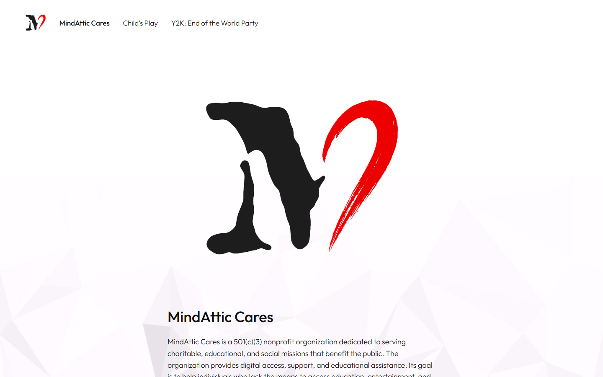
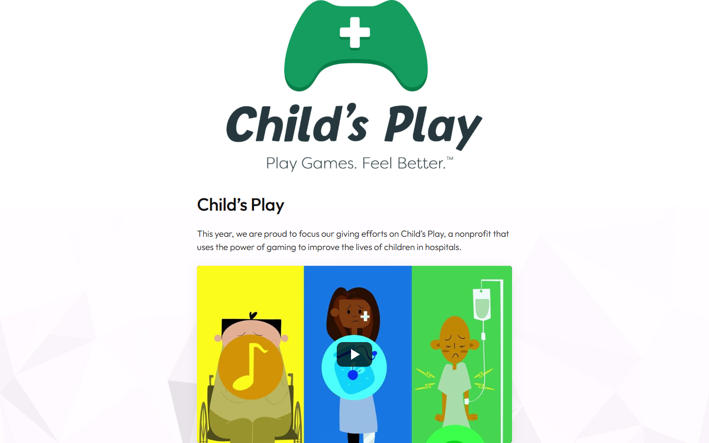
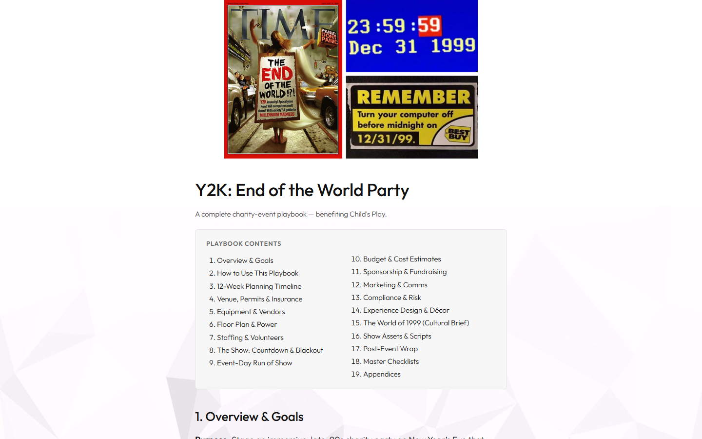

# mindatticcares.com

MindAttic Cares, the charity arm of MindAttic LLC: one static page that publishes full fundraising-event playbooks in the open, starting with a Y2K party benefiting Child's Play.

[](index.htm) [](index.htm) [](https://github.com/mindattic/MindAttic.UiUx) [](docs/BIBLE.md) [](https://mindatticcares.com)



Try it: [mindatticcares.com](https://mindatticcares.com/)

## Why

- See exactly how a charity event is planned: venue, permits, equipment, staffing, run of show, budget, sponsorship and wrap-up, all on the public page.
- Copy what works. The 12-week timeline, budget worksheet, sponsorship pitch structure and volunteer staffing model are written so another group can reuse them for its own event.
- Know where the money goes. The Child's Play track names its partner charity and the playbook sets its fundraising target in public.
- Read it anywhere, fork it in a text editor. The whole site is one `index.htm` with inline CSS and JS: no CMS, no framework, no build step, no analytics.

## Features

MindAttic Cares is the philanthropic arm of MindAttic LLC, described on the page as a 501(c)(3) nonprofit that provides digital access, support and educational assistance. The site is where its events and giving campaigns are organised and documented.

| Page | Content |
|---|---|
| MindAttic Cares (`#home`) | Who we are and why we run these events |
| Child's Play (`#childs-play`) | The giving track for [childsplaycharity.org](https://childsplaycharity.org/), the gaming community's children's-hospital charity: why this charity, how funds flow, partnership details and a click-to-load YouTube intro video |
| Y2K: End of the World Party (`#y2k`) | The full playbook for the first fundraiser in the track, in 19 sections |



The Y2K playbook plans a 1999-themed New Year's Eve party for the millennial crowd that ends at midnight in a staged "Y2K power failure". Its 19 sections are:

1. Overview and goals
2. How to use this playbook
3. 12-week planning timeline
4. Venue, permits and insurance
5. Equipment and vendors
6. Floor plan and power
7. Staffing and volunteers
8. The show: countdown and blackout
9. Event-day run of show
10. Budget and cost estimates
11. Sponsorship and fundraising
12. Marketing and comms
13. Compliance and risk
14. Experience design and decor
15. The World of 1999 (cultural brief)
16. Show assets and scripts
17. Post-event wrap
18. Master checklists
19. Appendices



Each later event will be drafted on the same page in the same structure, so readers (and any charity looking for a template) get a consistent read. [RFC 0001](docs/rfc/0001-multi-event-playbooks.md) holds the plan for adding a second event without breaking the single-page model.

## Quick start

You need a modern browser. The text and navigation work offline; fonts and images load from jsDelivr when you are online.

```powershell
git clone https://github.com/mindattic/mindatticcares.com
cd mindatticcares.com
start index.htm
```

You should see the MindAttic Cares home page with links to Child's Play and the Y2K playbook along the top. Opened over `file://`, the intro video opens on YouTube in a new tab instead of embedding (see [How it works](#how-it-works)).

## How it works

The full architectural writeup lives in [BIBLE §4](docs/BIBLE.md#MAC-§4). The short version:

- Three pages, one document. `<main>` holds three `<section class="page">` blocks, `home`, `childs-play` and `y2k`, and exactly one carries the `.active` class at a time.
- Hash router. One trailing `<script>` implements `show(name)` (toggles `.active` on the matching page and nav link, scrolls to top) and `fromHash()`. Bare page names like `#childs-play` select that page directly; any other anchor, such as `#sec-budget` or `#contents`, opens the page that contains it and scrolls it into view.
- In-page table of contents. The Y2K page carries `<nav class="toc" id="contents">` linking to all 19 `<h2 id="sec-*" class="sec">` sections, so `#contents` deep-links to it. The sections have no per-section "back to contents" links (removed 2026-10-03, MAC-A4).
- Click-to-load YouTube. The Child's Play intro video is a `.video[data-yt]` poster that, on click or Enter, swaps itself for a `youtube-nocookie.com` iframe. Over `file://`, where the iframe would be blocked, it opens the video in a new tab instead.
- Last-Updated stamp. The file's first line is a `Last Updated` HTML comment with an ISO 8601 UTC time, rewritten by the MindAttic.Deploy pipeline on every deploy, not by hand.

Per [MAC-LAW-4](docs/BIBLE.md#MAC-LAW-4), the `id` values on pages and `sec-*` headings are load-bearing: the hash router and the table of contents key off them, so renaming one is a breaking navigation change that must update every reference.

## Stack

| Layer | Technology |
|---|---|
| Front end | One hand-authored `index.htm` (about 60 KB): inline `<style>` CSS and one inline `<script>`. No framework, no build step |
| Assets | Fonts (Outfit), logos, icons and photos are static files in the MindAttic.UiUx repo, served by jsDelivr and pinned to a release tag (`@V9`). The page uses `preconnect` and `preload` for the CDN and the body font, `loading="lazy"` for below-the-fold images, and `srcset` for the large Y2K photo |
| Hosting | Static hosting (no server-side code, no database), see [Deployment](#deployment) |
| Deploy | Centralised in the sibling MindAttic.Deploy repo |
| Docs tooling | `tools/codex.ps1` (PowerShell 5.1, no external dependencies) validates and regenerates the Codex docs only; it does not touch `index.htm` |

## Editing the site

Open `index.htm` in any editor. Sections are marked by `<h2 id="sec-*" class="sec">` headings (for example `sec-overview`, `sec-timeline`, `sec-budget`); the table of contents and hash router are wired to those IDs. The CSS palette and playbook layout live in the `<style>` block near the top; the script is small and sits in the single `<script>` block at the bottom.

To add a new event:

1. Add a new `<section class="page">` with its `<h1>` at the right insertion point.
2. Copy the section template (`<h2 id="sec-...">` cards) from the Y2K playbook.
3. Update the in-page table of contents (`<nav class="toc">`) and the top navigation (`<header class="topbar"><nav>`).
4. Namespace the new `sec-*` IDs per event to avoid anchor collisions with the Y2K playbook (see [RFC 0001](docs/rfc/0001-multi-event-playbooks.md) for the agreed approach once a second event lands).
5. Put any new image in `MindAttic.UiUx/mindatticcares.com/<category>/` (see [Assets](#assets)), tag a new UiUx release and point the page at it.
6. Deploy through MindAttic.Deploy (see [Deployment](#deployment)).

## Assets

Binary assets are not embedded in `index.htm`. They are plain static files in the shared MindAttic.UiUx repo, organised by domain, and served at runtime by jsDelivr so the browser caches them and they are shared across MindAttic sites:

```text
MindAttic.UiUx/
├── fonts/outfit/            # shared Outfit woff2 (Latin + Latin-Extended)
└── mindatticcares.com/
    ├── logos/               # M-Cares art (300/720 px web sizes) + the Child's Play logo
    ├── icons/               # favicon / apple-touch icon
    └── images/              # photos, video poster, page background
```

- URL pattern: `https://cdn.jsdelivr.net/gh/mindattic/MindAttic.UiUx@V9/mindatticcares.com/<category>/<file>`, for example `.../logos/m-cares-black-red-transparent-720.png`. Fonts: `https://cdn.jsdelivr.net/gh/mindattic/MindAttic.UiUx@V9/fonts/outfit/outfit-latin.woff2`.
- Pinned to a tag. `@V9` is a whole-number UiUx release tag (HOUSE-LAW-1). Tags are immutable on jsDelivr, so what the page loads today is exactly what it loads tomorrow. To change an asset, add or replace the file in UiUx, cut a new tag and bump the tag in `index.htm` (the linked deploy does the last two steps for you).
- Naming: lowercase kebab-case, descriptive, with the pixel width as a suffix for resized web variants (`-300.png`, `-720.png`, `-960.jpg`).
- Full resolution: JPEGs are stored byte-identical at full resolution. The Y2K photo is the original 1920 by 1200, with a 960 px variant offered through `srcset`. PNGs may be recompressed only losslessly.
- What may be external: only static files from this package ([MAC-A2](docs/AMENDMENTS.md#MAC-A2)). No analytics, trackers or third-party fonts (no Google Fonts requests).

## Tooling

`tools/` holds two independent PowerShell scripts with no npm or build dependency. Both run with Windows PowerShell 5.1 or PowerShell 7+.

| Script | Purpose |
|---|---|
| `tools/codex.ps1` | Codex documentation CLI. `doctor` validates `docs/` (front-matter, stable IDs, cross-references, cited tests and paths, digest freshness) and exits non-zero on any hard error. `digest` regenerates `docs/BIBLE.digest.md` from BIBLE §1, §3, §5 and §9 plus a user-story status index and the latest amendment head |
| `tools/build-readme.ps1` | Thin wrapper that regenerates `README.htm` from `README.md` through the shared `codex-standard/build-readme.ps1` engine. Edit the shared engine to change output, not this wrapper |

```powershell
# Validate the Codex docs (exit 0 required before committing doc changes)
powershell -NoProfile -ExecutionPolicy Bypass -File tools\codex.ps1 doctor

# Regenerate docs/BIBLE.digest.md after editing BIBLE §1/§3/§5/§9 or adding an amendment
powershell -NoProfile -ExecutionPolicy Bypass -File tools\codex.ps1 digest

# Regenerate README.htm from README.md
powershell -NoProfile -ExecutionPolicy Bypass -File tools\build-readme.ps1
```

`README.htm` and `index.htm` are unrelated: `index.htm` is the deployed site; `README.htm` is a local, generated rendering of this README and is not deployed.

## Deployment

Per-project deploy scripts are retired: `deploy.bat`, `deploy.ps1` and a per-folder `settings.json` no longer exist here ([MAC-A1](docs/AMENDMENTS.md#MAC-A1)). Deployment is owned by the sibling MindAttic.Deploy repo. Use the `/deploy` Claude Code command, or run:

```powershell
cd D:\Projects\MindAttic\MindAttic.Deploy
npm run deploy -- --site mindatticcares.com
```

This site is registered as a verbatim root-site FTP upload in `MindAttic.Deploy/projects.json` under `sites[]`, with `sourceDir: "../mindatticcares.com"`, `ftpRemotePath: "/mindatticcares.com"` and `files: ["index.htm"]`. The pipeline stamps the `Last Updated` comment in `index.htm` and FTPS-uploads it. FTP credentials are centralised in MindAttic.Deploy and never read from this repo.

Linked deploy: this site is permanently linked with MindAttic.UiUx, ryandebraal.com and mindattic.com. The command above deploys all four: it publishes the UiUx package as the next tag (if it changed), pins that tag in every site, checks every asset is live on jsDelivr, then uploads ryandebraal.com, this site and mindattic.com. `--dry-run` previews; `--no-link` deploys this site alone. Details: [.claude/commands/deploy.md](.claude/commands/deploy.md) and the MindAttic.Deploy README ("Linked deploy").

Where it is served: the FTP path `/mindatticcares.com/` is served at `https://ryandebraal.com/mindatticcares.com/`. The domain `https://mindatticcares.com/` is a registrar masked forward: a frameset whose single frame loads that URL, so the address bar keeps showing mindatticcares.com. Two consequences:

- The page always runs inside a frame, so external links open in a new tab.
- A hash typed after the bare domain (`mindatticcares.com/#y2k`) is not passed into the frame. Share deep links in the `https://ryandebraal.com/mindatticcares.com/#y2k` form.

## Limitations

- No automated test or build suite in this repo by design ([MAC-LAW-1](docs/BIBLE.md#MAC-LAW-1): no build step). Under HOUSE-LAW-8 ("verified done, not asserted") a story is only marked done once it cites an automated test, and the only automated check here is `tools/codex.ps1 doctor`, which validates the documentation, not the site. So behaviour that is present and manually observable (the hash router, the table of contents, the YouTube embed, the deploy wiring) is held at "manually verified".
- An anchor and link checker and an HTML and accessibility CI pass are queued in [`docs/USER_STORIES.md`](docs/USER_STORIES.md) but not built.
- One event per page today. Scaling to several events is planned in [RFC 0001](docs/rfc/0001-multi-event-playbooks.md).

## Documentation

This repo follows the MindAttic Codex documentation standard (project code MAC). A fact lives in one layer; this README links to it rather than restating it.

| Layer | File | What it holds |
|---|---|---|
| L0, Bible | [docs/BIBLE.md](docs/BIBLE.md) | What MindAttic Cares is and is not, architecture, the Laws (`MAC-LAW-*`), verified state, glossary |
| L1, Amendments | [docs/AMENDMENTS.md](docs/AMENDMENTS.md) | Append-only change log (`MAC-A<n>`); an amendment wins over the bible |
| L2, User stories | [`docs/USER_STORIES.md`](docs/USER_STORIES.md) | Stories `MAC-US-<Epic><n>` across three epics: visitor reading the site, charity forking a playbook, maintainer publishing |
| rfc | [docs/rfc](docs/rfc/) | Design notes that graduate into the bible and stories once decided |
| Generated | [docs/BIBLE.digest.md](docs/BIBLE.digest.md) | Produced by `tools/codex.ps1 digest` and injected at session start by `.claude/hooks/inject-digest.ps1`. Never hand-edited |
| Org laws | [MindAttic.HouseRules.md](../MindAttic.HouseRules.md) | Inherited by reference from BIBLE §5 (whole-number versioning, credential handling, verified-done) |

Agent instructions: [AGENTS.md](AGENTS.md) is the project's agent entrypoint and `CLAUDE.md` forwards to the workspace-wide MindAttic agent standard. The `.claude/` folder configures Claude Code sessions here and does not affect the deployed site:

- `settings.json` wires the status line (`statusline.ps1`, a context-window usage gauge), a `SessionStart` hook (`inject-digest.ps1`) and a `UserPromptSubmit` hook (`quickload-on-do.ps1`, which restores a quicksave when you reply `do`).
- `commands/` holds `/deploy`, `/quicksave` and `/quickload`.
- `skills/` holds `commit`, `discard`, `revert` and `run`.

## License

This repo has no LICENSE file. All rights reserved.

Related: [Child's Play](https://childsplaycharity.org/), the children's-hospital charity that receives the Y2K event's proceeds.

---

Part of [MindAttic](https://mindattic.com) — see more projects at [github.com/mindattic](https://github.com/mindattic). Related: [mindattic.com](https://github.com/mindattic/mindattic.com), [ryandebraal.com](https://github.com/mindattic/ryandebraal.com), [MindAttic.UiUx](https://github.com/mindattic/MindAttic.UiUx), [MindAttic.Deploy](https://github.com/mindattic/MindAttic.Deploy).
